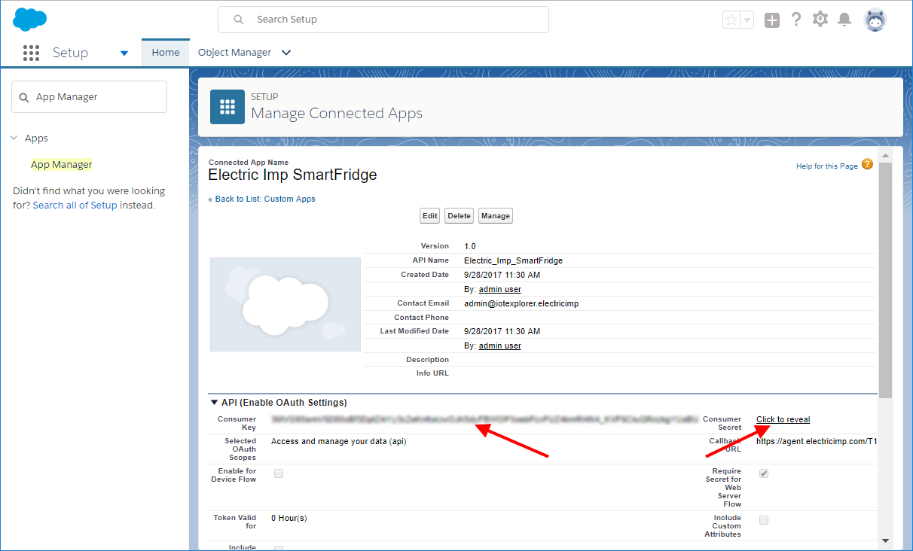

# Salesforce Smart Refrigerator #

This example uses the Electric Imp Platform to connect and monitor a refrigerator, and Salesforce to track the current temperature, humidity in the fridge, and whether the fridge door is open or closed.

The impExplorer&trade; Kit used in this example reads data from its sensors every 15 seconds. It reads the temperature and the humidity of the air around it, and sends those readings to Salesforce. The impExplorer Kit also senses light and uses this to determine whether the fridge door is open (bright light) or closed (no light). Again, the light-level reading is sent to Salesforce.

## Step 1: What You Need ##

### General ###

- Your 2.4GHz 802.11n Wi-Fi network name (SSID) and password.
- A smartphone or tablet (iOS or Android).
- A computer with a web browser.

### Accounts ###

- An [Electric Imp developer account](https://impcentral.electricimp.com/login).
- The Electric Imp mobile app ([iOS](https://itunes.apple.com/us/app/electric-imp/id547133856) or [Android](https://play.google.com/store/apps/details?id=com.electricimp.electricimp)).
- A [Salesforce Developer Edition](https://developer.salesforce.com/signup) or [Trailhead Playground org](https://developer.salesforce.com/signup) account.

### Hardware ###

- An Electric Imp [impExplorer Kit](https://store.electricimp.com/collections/featured-products/products/impexplorer-developer-kit-for-salesforce-trailhead?variant=31720746706).
- 3 AA batteries (to run the board from inside a fridge).

## Step 2: Set up the Electric Imp Hardware ##

First we will need to assemble the impExplorer Kit. The kit comes with.

- An imp001 card, which contains a Wi-Fi radio and the microcontroller that drives all the logic for the board.
- The impExplorer board into which the card is plugged.

The impExplorer’s imp001 connects to any **2.4GHz** WiFi network compatible with the **802.11n** standard or below. It cannot connect to a 5GHz 802.11n network. For more information on imp network requirements, please see [*Network Requirements for imp-enabled Devices*](https://electricimp.com/docs/troubleshooting/networks/).

### Hardware Setup ###

- Plug the imp001 card into the card slot on the impExplorer.
- Power up your impExplorer Kit with the provided mini-B USB cable or the AA batteries.
- The imp001 should now have power and be blinking amber (or red if it has been used before).

### Electric Imp BlinkUp&trade; ###

Use the Electric Imp mobile app to activate your device: configure it with Wi-Fi access credentials and enroll it into the Electric Imp impCloud&trade;. Activation takes place through a process called BlinkUp.

1. Launch the app.
1. Sign into your Electric Imp account.
1. At the main menu, tap **Configure a Device**.
1. Select **Wireless**.
1. Enter your Wi-Fi credentials.
1. Follow the instructions in the app to activate your device.
1. After a successful BlinkUp, the app will show you your impExplorer’s unique device ID. You will need this later.

When you enter your Wi-Fi details, the app may set the SSID field for you. It will enter the name of the network your phone or tablet is connected to. This may not be the one you wish to connect your impExplorer to; if not, just tap on the name to key in the correct SSID.

The impExplorer needs to connect to a **2.4GHz 802.11n** Wi-Fi network, so you will need to make sure one is available. This is especially the case if your phone is connected to a 5GHz network as the impExplorer will not be able to connect to this. You may need to set up a separate or guest network to try this example. If in doubt, consult your network manager.

If you have any issues getting started with your Electric Imp account or device, please follow Steps 1 through 7 in [the full getting started guide](https://electricimp.com/docs/gettingstarted/explorer/quickstartguide/).

## Step 3: Enter Device and Agent Code ##

Electric Imp applications are developed and managed in an online tool called impCentral&trade;. This web app provides all the facilities you need to write and deploy the software (to the device and to the agent) that will control your imp-enabled connected product. For more details on impCentral, see [‘Introduction to impCentral’](https://electricimp.com/docs/tools/impcentral/impcentralintroduction/).

1. In your favorite web browser log into [impCentral](https://preview-impcentral.electricimp.com/login).
1. Click **Create a Product**.

1. In the popup, enter a Product name (e.g., **SmartFridge**), an Application Workspace name (e.g., **SmartFridge**), and then click **Create**.
<br>A Product defines a new connected product in the Electric Imp impCloud. An Application Workspace is the place where you develop and test your application software, both the device code and the agent code.
1. Copy and paste the [agent code](./OAuth2_SmartRefrigerator.agent.nut) from Github into the left-hand window pane as shown in the image below.
1. Copy and paste the [device code](./OAuth2_SmartRefrigerator.device.nut) from Github into the right-hand window pane as shown in the image below.
1. Click **Assign devices**.

1. In the **Assign Devices** popup, choose your impExplorer by locating its device ID, and click **Assign**.

1. Leave impCentral open in your browser &mdash; you will be returning to it later.

## Step 4: Authenticating Device with Salesforce ##

To authenticate your device with Salesforce you will need to create a Salesforce **Connected Application**. The settings are slightly different based on how you choose to authenticate with Salesforce. This example supports either the Device OAuth Flow or JWT OAuth Flow. The Device OAuth flow requires human interaction to authenticate each device, where as the JWT OAuth flow requires more set-up, including certificate creation that each device will then use to authenticate and permission configuration in Salesforce. If using Device OAuth flow please skip ahead to [Create a Salesforce Connected Application](#create-a-salesforce-connected-application)

### JWT Flow Generate Certificates ###

The JWT bearer flow supports the RSA SHA256 algorithm, which uses an uploaded certificate as the signing secret. In these next steps we will use the command line and `openssl` to generate a certificate. 

1. On the command line, navigate to somewhere outside of your project directory, so that we can create a folder that will not be shared. This folder will store your certificates for this application. It is important to keep track of these files since they contain sensitive information that others can use to compromise your system. Use this command to create a folder:  

    `mkdir salesforce_cell_tracker_certificates`

1. Change directories into your newly created certificates folder:

    `cd salesforce_cell_tracker_certificates`

1. From inside the certificates folder, generate an RSA private key:

    `openssl genrsa -des3 -passout pass:x -out server.pass.key 2048`

1. Create a key file from the server.pass.key file:

    `openssl rsa -passin pass:x -in server.pass.key -out server.key`

1. Delete the server.pass.key:

    `rm server.pass.key`

1. Request and generate the certificate:

    `openssl req -new -key server.key -out server.csr`

1. You will be asked to enter information to create a certificate. You should enter everything except: 
    - Enter a period (.) to skip entering an optional company name
    - You will not need a challenge password, so just press `Enter`. The Certificate Authorities use this password to authenticate the certificate owner when they want to revoke their certificate. Because it’s a self-signed certificate, there’s no way to revoke it via CRL (Certificate Revocation List).

1. Generate the SSL certificate:

    `openssl x509 -req -sha256 -days 365 -in server.csr -signkey server.key -out server.crt`

1. You should now have 3 files in this folder 
    - `server.crt` - your site certificate, this will be uploaded to your connected app in the next step
    - `server.csr` 
    - `server.key` - this is the key that will be used in your code to authenticate your device, you will enter this into your agent code

### Create a Salesforce Connected Application ###

The API (Enable OAuth Settings) setup is slightly different for each Flow. Please follow the directions in step 2.3 for your preferred OAuth flow. 

1. Log into Salesforce by launching your Developer Edition or Trailhead Playground org.
1. Click the **Setup** icon in the top-right navigation menu and select **Setup**.

- Enter **App Manager** in the **Quick Find** box and then select **AppManager**.

1. Click **New Connected App**.
1. In the **New Connected App** form, fill in:
    1. In the **Basic Information** section:
        1. Connect App Name: **Electric Imp SmartFridge**
        1. API Name: this will automatically become **Electric_Imp_SmartFridge**.
        1. Contact Email: enter your email address.
    1. In the **API (Enable OAuth Settings)** section:
        1. Check **Enable OAuth Settings**.
        1. Callback URL: this is a required field, however our application will not use this url, so you may enter `http://localhost:1717/OauthRedirect`.
        1. Configure Authentication 
            - For OAUTH 2.0 Device Flow
                - Check **Enable for Device Flow**
            - For OAUTH 2.0 JWT Flow
                - Check **Use digital signatures**
                - Click **Choose file** and select the `server.crt` file created in [JWT Flow Generate Certificates](#jwt-flow-generate-certificates)
    1. Under **Selected OAuth Scopes**:
        1. Select **Access and manage your data (api)**.
        1. Select **Perform requests on your behalf at any time (refresh_token, offline_access)**.
        1. Click **Add**.

    1. Click **Save**.
    1. Click **Continue**.
1. You will be redirected to your Connected App’s page.
    1. Make a note of your **Consumer Key** (you will need to enter it into your agent code).
    1. Click **Click to reveal** next to the **Consumer Secret** field.
    1. Make a note of your **Consumer Secret** (you will need to enter these into your agent code).


If using Device OAuth flow please skip ahead to [Adding Authentication to Agent Code](#adding-authentication-to-agent-code)

### JWT Flow Edit OAuth Policies ###

Next you will need to edit the policies to enable the connected app to circumvent the manual login process. Under your application:

1. Select or Click *Manage*
1. Click *Edit Policies*
    - Under *OAuth policies* 
        - Select *Admin approved users are pre-authorized* from *Permitted Users* dropdown
    - Click *Save*

### JWT Flow Create Permission Set ###

Next we need to create a permission set and assign pre-authorized users for this connected app. This will allow your device to connect using the certificate instead of a user login.

1. Select *Setup* then in the sidebar under *Administration* -> *Users* select *Permission Sets*
1. Click *New*
    - Enter a *Label* 
    - Click *Save* 
1. Click on your new permission set label
1. Click *Manage Assignments*
1. Click *Add Assignments*
    - Check the box to select the User that matches your username
    - Click *Assign* & *Done*
1. Navigate back to your connected app
    - In the sidebar under *Platform Tools* -> *Apps* select *App Manager*
    - In the list of of apps find your app and under the dropdown arrow on the left select *Manage*
    - Scroll down to the *Permission Sets* section and click the *Manage Permission Sets* button
    - Select the permission set that matches your new permission set label
    - Click *Save*

### Adding Authentication to Agent Code ###

TODO: find constants at the top of the agent code just after the library require statements - copy and paste consumer key and secret, for JWT paste in certificate and username

## Step 5: Create a Platform Event in Salesforce ##

TODO: add instructions here to configure platform event and push data??
add event name to code.

See [platform event trailhead](https://trailhead.salesforce.com/en/content/learn/modules/platform_events_basics/platform_events_define_publish) for how to create a platform event. This code uses the REST API to publish events.  

## Step 6: Deploying Application ##

TODO: add instructions for deploying code and authenticating device via device flow

For Device Flow OAuth these steps will need to be followed once your device starts to run the Squirrel application code. Please skim through them so you are familiar with what you need to look out for. 

Once your device is running, you will see logs similar to the following:  

```
2019-06-21 14:23:14-0700 [Agent]  [INFO]: -----------------------------------------------------------------
2019-06-21 14:23:14-0700 [Agent]  [INFO]: [SalesForceOAuth2Device] Salesforce: Authorization is pending. Please grant access
2019-06-21 14:23:14-0700 [Agent]  [INFO]: [SalesForceOAuth2Device] URL: https://login.salesforce.com/setup/connect
2019-06-21 14:23:14-0700 [Agent]  [INFO]: [SalesForceOAuth2Device] Code: 6VL44ZGC
2019-06-21 14:23:14-0700 [Agent]  [INFO]: -----------------------------------------------------------------
2019-06-21 14:23:20-0700 [Agent]  [OAuth2DeviceFlow] Polling: authorization_pending
```

use the agent url to launch a web page for easy copy paste of code and link to launch form or 

Copy and paste the URL in a web browser, then copy and paste the alpha numeric code (ie 6VL44ZGC) into the form on that webpage. You will be re-directed to a salesforce log-in page (if you are not currently logged into Salesforce). Once you log in you will see the following logs from your imp device:

```
2019-07-23 12:20:04-0700 [Agent]  [OAuth2DeviceFlow] Polling: authorization_pending
2019-07-23 12:20:09-0700 [Agent]  [OAuth2DeviceFlow] Polling: authorization_pending
2019-07-23 12:20:14-0700 [Agent]  [OAuth2DeviceFlow] Polling: authorization_pending
2019-07-23 12:20:20-0700 [Agent]  [OAuth2DeviceFlow] Polling: authorization_pending
2019-07-23 12:20:25-0700 [Agent]  [OAuth2DeviceFlow] Polling success
2019-07-23 12:20:25-0700 [Agent]  [OAuth2DeviceFlow] Change status of session 1 from waiting for user to idle
```

Your device is now authorized and will begin sending data to Salesforce.