# Salesforce Smart Refrigerator

This example uses the Electric Imp Platform to connect and monitor a refrigerator, and Salesforce to track the current temperature, humidity in the fridge, and whether the fridge door is open or closed.

The impExplorer&trade; Kit used in this example reads data from its sensors every 15 seconds. It reads the temperature and the humidity of the air around it, and sends those readings to Salesforce using Salesforce Platform Events. The impExplorer Kit also senses light and uses this to determine whether the fridge door is open (bright light) or closed (no light). Again, the light-level reading is sent to Salesforce using Salesforce Platform Events.

Salesforce stores the incoming data and opens a Case using IoT Explorer Orchestration if one of the following occurs.

1. The refrigerator door is open for longer than a predefined period.
2. The temperature rises above a predefined threshold.
3. The relative humidity rises above a predefined threshold.

All thresholds are defined later, at the step when you set up IoT Explorer Orchestration.

## Step 1: What You Need

### General

- Your Wi-Fi network name (SSID) and password.
- A smartphone (iOS or Android).
- A computer with a web browser.

### Accounts

- An [Electric Imp developer account](https://preview-impcentral.electricimp.com/login).
- The Electric Imp mobile app ([iOS](https://itunes.apple.com/us/app/electric-imp/id547133856) or [Android](https://play.google.com/store/apps/details?id=com.electricimp.electricimp)).
- A [Salesforce Developer Edition](https://developer.salesforce.com/signup) or [Trailhead Playground org](https://developer.salesforce.com/signup) account.

### Hardware

- An Electric Imp [impExplorer Kit](https://store.electricimp.com/collections/featured-products/products/impexplorer-developer-kit-for-salesforce-trailhead?variant=31720746706).
- 3 AA batteries (to run the board from inside a fridge).

## Step 2: Set up the Electric Imp Hardware

First we will need to assemble the impExplorer Kit. The kit comes with.

- An imp001 card, which contains a Wi-Fi radio and the microcontroller that drives all the logic for the board.
- The impExplorer board into which the card is plugged.

### Hardware Setup

- Plug the imp001 card into the card slot on the impExplorer.
- Power up your impExplorer Kit with the provided mini-B USB cable or the AA batteries.
- The imp001 should now have power and be blinking amber (or red if it has been used before).

Assembled, it should look like this.

 and the three AA batteries in the underside bay (right)")

### Electric Imp BlinkUp&trade;

Use the Electric Imp mobile app to activate your device: configure it with Wi-Fi access credentials and enroll it into the Electric Imp impCloud&trade;. Activation takes place through a process called BlinkUp.

1. Launch the app.
1. Sign into your Electric Imp account.
1. At the main menu, tap **Configure a Device**.
1. Select **Wireless**.
1. Enter your Wi-Fi credentials.
1. Follow the instructions in the app to activate your device.
1. After a successful BlinkUp, the app will show you your impExplorer’s unique device ID. You will need this later.

When you enter your Wi-Fi details, the app may set the SSID field for you. It will enter the name of the network your phone or tablet is connected to. This may not be the one you wish to connect your impExplorer to; if not, just tap on the name to key in the correct SSID.

The impExplorer needs to connect to a **2.4GHz 802.11n** Wi-Fi network, so you will need to make sure one is available. This is especially the case if your phone is connected to a 5GHz network as the impExplorer will not be able to connect to this. You may need to set up a separate or guest network to try this example. If in doubt, consult your network manager.

If you have any issues getting started with your Electric Imp account or device, please follow Steps 1 through 7 in [the full getting started guide](https://electricimp.com/docs/gettingstarted/explorer/quickstartguide/).

### The Electric Imp Platform

The Electric Imp IoT Connectivity Platform has two core elements: the device and the impCloud&trade;. The device runs software of its own (the imp application’s ‘device code’) and is assisted by software running in the impCloud. This assistant is called an ‘agent’, and each device has an agent all of its own. The agent (running the imp application’s ‘agent code’) operates as the device’s front end to the Internet.

In this example, the agent code receives data from the device and forwards it to Salesforce as a Platform Event, as the following diagram shows.

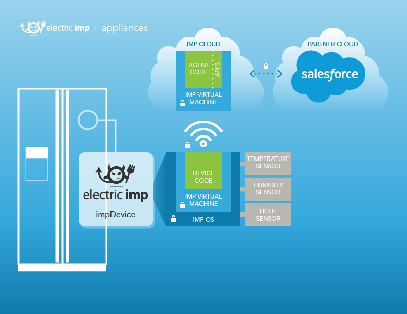

Electric Imp applications are developed and managed in an online tool called impCentral&trade;. This web app provides all the facilities you need to write and deploy the software (to the device and to the agent) that will control your imp-enabled connected product. For more details on impCentral, see [‘Introduction to impCentral’](https://electricimp.com/docs/tools/impcentral/impcentralintroduction/).

## Step 3: Enter Device and Agent Code

1. In your favorite web browser log into [impCentral](https://preview-impcentral.electricimp.com/login).
1. Click **Create a Product**.
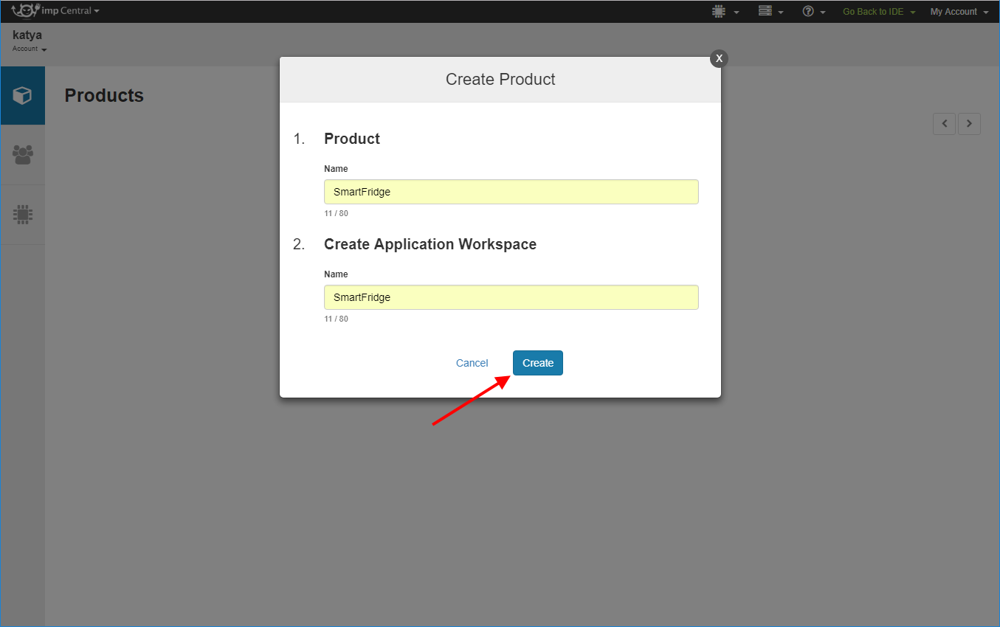
1. In the popup, enter a Product name (e.g., **SmartFridge**), an Application Workspace name (e.g., **SmartFridge**), and then click **Create**.
<br>A Product defines a new connected product in the Electric Imp impCloud. An Application Workspace is the place where you develop and test your application software, both the device code and the agent code.
1. Copy and paste the [agent code](./SmartRefrigerator_ExplorerKit_Salesforce.agent.nut) from Github into the left-hand window pane as shown in the image below.
1. Copy and paste the [device code](./SmartRefrigerator_ExplorerKit_Salesforce.device.nut) from Github into the right-hand window pane as shown in the image below.
1. Click **Assign devices**.
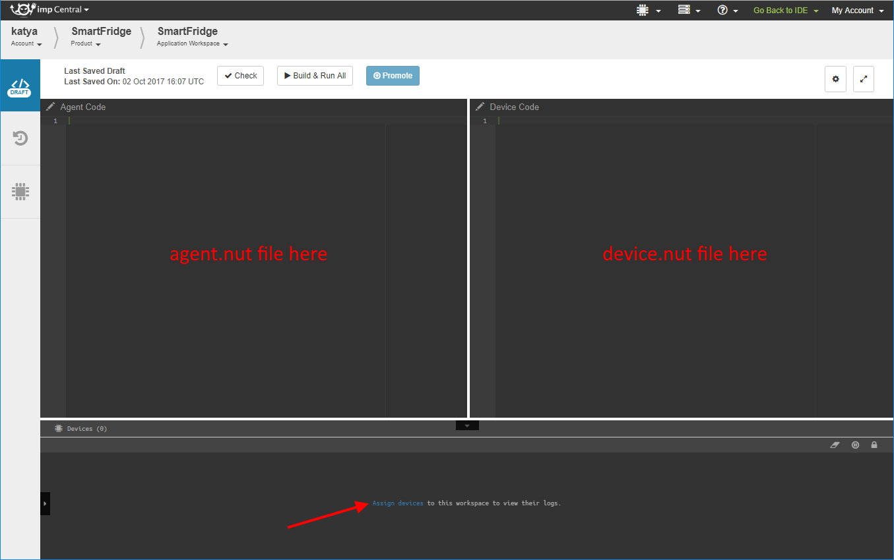
1. In the **Assign Devices** popup, choose your impExplorer by locating its device ID, and click **Assign**.

1. At the top of the logs pane you can find the agent URL of your device. It will look something like this: **https://agent.electricimp.com/szPc0sLfAqlu**
1. Make a note of the agent URL. You will need it when you create your connected app in Salesforce.

1. Leave impCentral open in your browser &mdash; you will be returning to it later.

## Salesforce IoT Explorer

The data received from the device may be processed, stored, and analyzed within Salesforce. This example demonstrates just a few of the many capabilities of Salesforce, which can be modified or extended as you explore further.

In this example, you create the following Salesforce entities:

- **Connected Application** (Step 4) Authenticates the imp application in Salesforce so that Platform Events sent by the imp application are accepted by Salesforce.
- **Custom Object** (Step 5) Stores the data received from the device so that the historical data can be monitored, for example using the Salesforce1 mobile app.
- **Platform Event** (Step 6) Transfers the data from the device to Salesforce. A **Platform Event Trigger** inserts the received data into the Custom Object.
- **IoT Explorer Context** (Step 7) Lets you set up IoT Explorer Orchestration.
- **Custom Case Field** (Step 8) Opens customized **Cases**: a standard **Case** object with an additional field, the device ID.
- **IoT Explorer Orchestration** (Step 9) Defines a fridge state machine that reacts to incoming Platform Events and opens Cases as required.
- **Custom Object Tab** (Step 12) Lets you make the Custom Object (with the stored data from the device) accessible from the Salesforce1 mobile app.

The Platform Event acts as an interface between the imp application and Salesforce. The Platform Event fields must have the names and types used in this example (see Step 6). If you change anything in the Platform Event definition, you will need to update the imp application’s agent source code. The name of the Platform Event is set in the agent code by the constant *READING_EVENT_NAME*.

All other entities listed above are fully independent of the imp application.

In this project, we explore a specific example, but this is just one scenario you can use. As you continue to explore using Electric Imp with Salesforce, you can try out different scenarios with new fields, rules, sets of entities, and more.

## Step 4: Create a Salesforce Connected Application

This stage is used to authenticate the imp application in Salesforce.

1. Launch your Developer Edition or Trailhead Playground org.
1. Click the **Setup** icon in the top-right navigation menu and select **Setup**.

- Enter **App Manager** in the **Quick Find** box and then select **AppManager**.
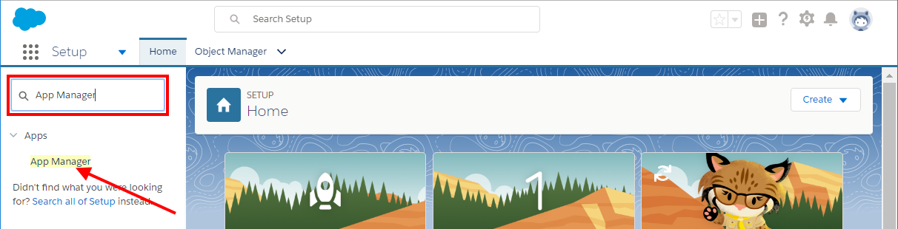
1. Click **New Connected App**.
1. In the **New Connected App** form, fill in:
    1. In the **Basic Information** section:
        1. Connect App Name: **Electric Imp SmartFridge**
        1. API Name: this will automatically become **Electric_Imp_SmartFridge**.
        1. Contact Email: enter your email address.
    1. In the **API (Enable OAuth Settings)** section:
        1. Check **Enable OAuth Settings**.
        1. Callback URL: enter the agent URL of your device (copy it from impCentral &mdash; see the previous step).
    1. Under **Selected OAuth Scopes**:
        1. Select **Access and manage your data (api)**.
        1. Click **Add**.
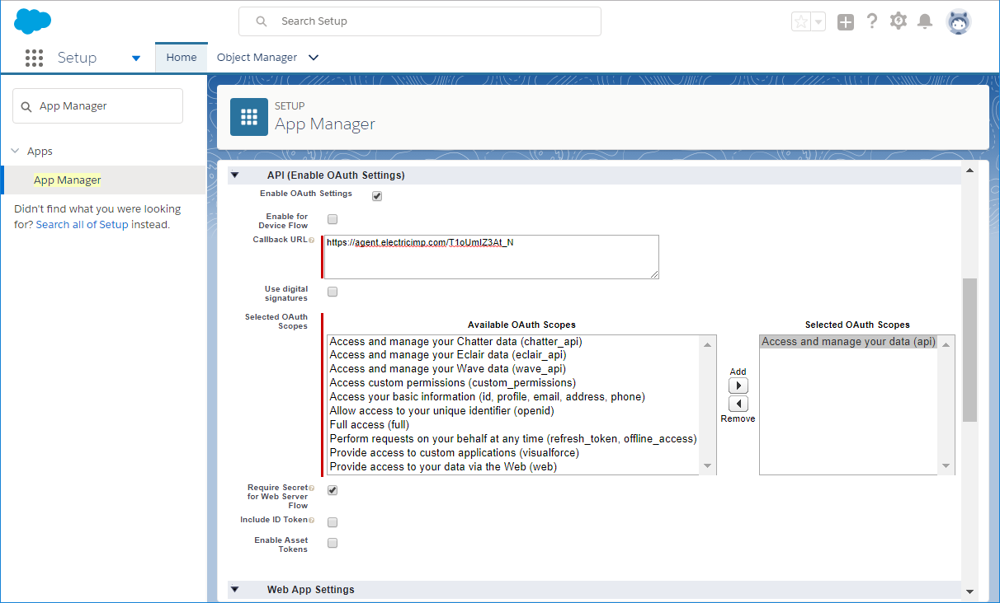
    1. Click **Save**.
    1. Click **Continue**.
1. You will be redirected to your Connected App’s page.
    1. Make a note of your **Consumer Key** (you will need to enter it into your agent code).
    1. Click **Click to reveal** next to the **Consumer Secret** field.
    1. Make a note of your **Consumer Secret** (you will need to enter it into your agent code).

1. Do not close the Salesforce page.

### Adding API Keys to Your Agent Code

1. Return to impCentral.
1. Find the *SALESFORCE CONSTANTS* section at the **end** of the agent code, and enter the **Consumer Key** and **Consumer Secret** from the step above as the values of the *CONSUMER_KEY* and *CONSUMER_SECRET* constants, respectively.

1. Again, do not close impCentral.

## Step 5: Create a Custom Object in Salesforce

The Custom Object will be used to store the data received from the device.

1. Return to the Salesforce page
1. Click the **Setup** icon in the top-right navigation menu and select **Setup**.

1. Click the **Object Manager** tab next to **Home**.

1. Click the **Create** drop-down and then select **Custom Object**.

1. In the **New Custom Object** form fill in:
    1. In the **Custom Object Information** section:
        1. Label: **SmartFridge**
        1. Plural Label: **SmartFridges**
        1. Object Name: **SmartFridge**
    1. In the **Enter the Record Name Label and Format** section:
        1. Record Name: **Reading Id** (replace the default **SmartFridge Name**).
        1. Data Type: **Auto Number**
        1. Display Format: **R-{0000}**
        1. Starting Number: **1**
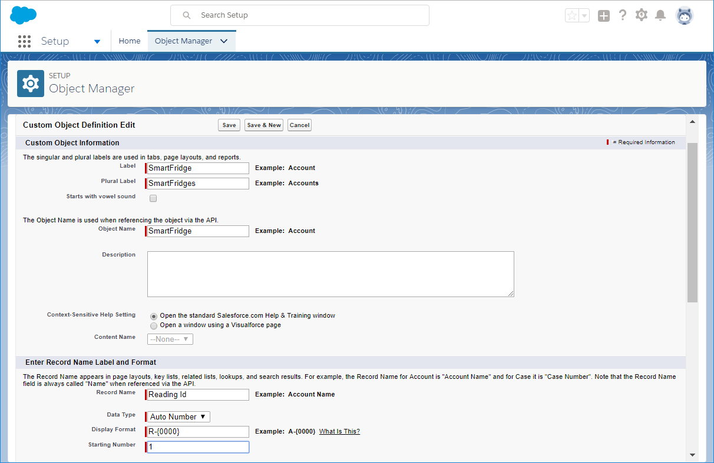
    1. Click **Save**.
1. On the **SmartFridge** Custom Object page, make sure that the **API Name** is **SmartFridge__c**.
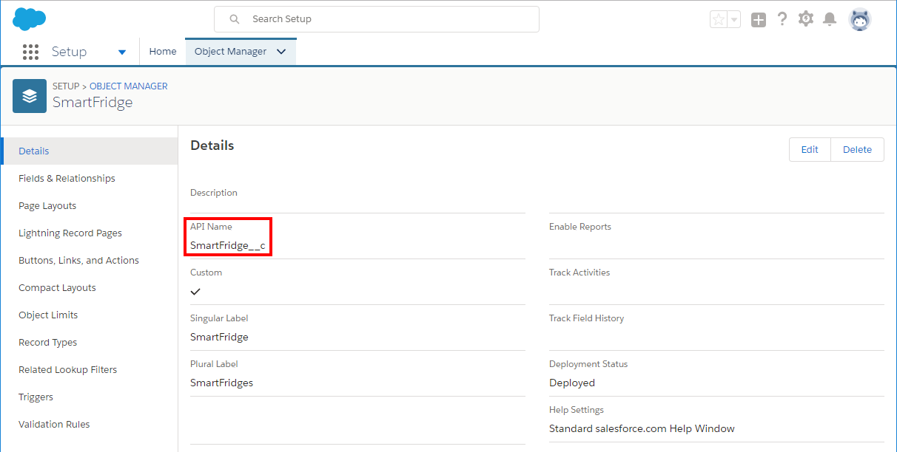
1. Select the **Fields & Relationships** section from the left navigation.
    1. Click **New**.
    1. Create a field for the temperature.
        1. In the **Step 1. Choose the field type** section:
            1. Data Type: **Number**
            1. Click **Next**
        1. In the **Step 2. Enter the field details** section:
            1. Field Label: **temperature**
            1. Length: **4**
            1. Decimal Places: **2**
            1. Field Name: **temperature**
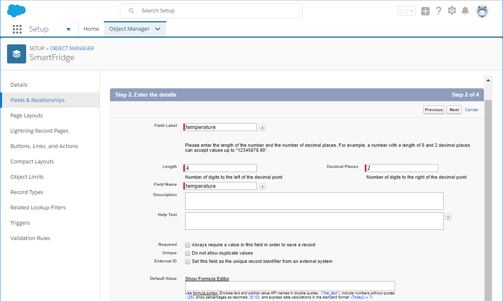
        1. Click **Next**, **Next**, and then **Save & New**.
    1. Create a field for the humidity.
        1. In the **Step 1. Choose the field type** section:
            1. Data Type: **Number**
            1. Click **Next**.
        1. In the **Step 2. Enter the details** section:
            1. Field Label: **humidity**
            1. Length: **4**
            1. Decimal Places: **2**
            1. Field Name: **humidity**
        1. Click **Next**, **Next**, and then **Save & New**.
    1. Create a field for the door status.
        1. In the **Step 1. Choose the field type** section:
            1. Data Type: **Picklist**
            1. Click **Next**.
        1. In the **Step 2. Enter the details** section:
            1. Field Label: **door**
            1. Values: Select **Enter values, with each value separated by a new line**.
            1. Enter **Open** and **Closed** on separate lines.
            1. Field Name: **door**
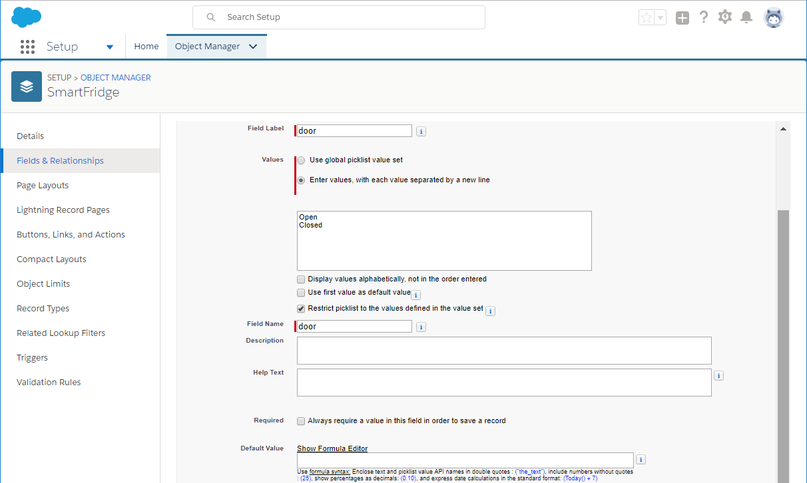
        1. Click **Next**, **Next**, and then **Save & New**.
    1. Create a field for the timestamp.
        1. In the **Step 1. Choose the field type** section:
            1. Data Type: **Date/Time**
            1. Click **Next**.
        1. In the **Step 2. Enter the details** section.
            1. Field Label: **ts**
            1. Field Name: **ts**
        1. Click **Next**, **Next**, and then **Save & New**.
    1. Create a field for the device’s ID.
        1. In the **Step 1. Choose the field type** section:
            1. Data Type: **Text**
            1. Click **Next**.
        1. In the **Step 2. Enter the details** section:
            1. Field Label: **deviceId**
            1. Length: **16**
            1. Field Name: **deviceId**
            1. Check **Always require a value in this field in order to save a record**.
            1. Check **Set this field as the unique record identifier from an external system**.

        1. Click **Next**, **Next**, and then **Save**.
1. Make sure that SmartFridge **Fields & Relationships** looks like this:


## Step 6: Create Platform Events in Salesforce

Platform Events transfer the data from the device to Salesforce. A Platform Event Trigger inserts the received data into the Custom Object we just defined.

The Platform Event fields must have the names and types mentioned here. If you change anything in the Platform Event definition, you will need to update the imp application’s agent code. The name of the Platform Event is entered into the agent code as a constant, *READING_EVENT_NAME*.

1. On the Salesforce page, click the **Setup** icon in the top-right navigation menu and select **Setup**.

1. Enter **Platform Events** into the **Quick Find** box and then select **Data > Platform Events**.

1. Click **New Platform Event**.
1. In the **New Platform Event** form, fill in:
    1. Field Label: **Smart Fridge Reading**
    1. Plural Label: **Smart Fridge Readings**
    1. Object Name: **Smart_Fridge_Reading**
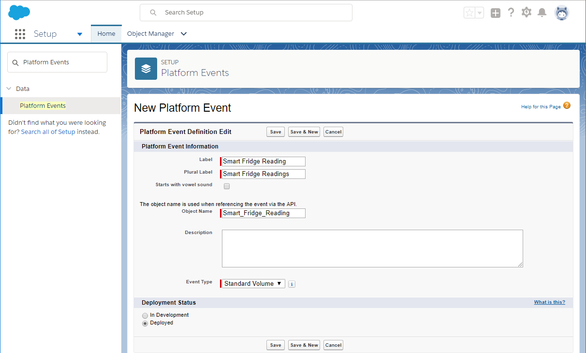
    1. Click **Save**.
1. You will be redirected to the **Smart Fridge Reading** Platform Event page. Now you need to create Platform Event fields that correspond to your fridge readings. In the **Custom Fields & Relationships** section, click **New** to create a field for the temperature.

    1. Data Type: **Number**
    1. Click **Next**.
    1. Field Label: **temperature**
    1. Length: **4**
    1. Decimal Places: **2**
    1. Field Name: **temperature**
    1. Click **Save**.
1. In the **Custom Fields & Relationships** section, click **New** to create a field for the humidity:
    1. Data Type: **Number**
    1. Click **Next**.
    1. Field Label: **humidity**
    1. Length: **4**
    1. Decimal Places: **2**
    1. Field Name: **humidity**
    1. Click **Save**.
1. In the **Custom Fields & Relationships** section, click **New** to create a field for the door status:
    1. Data Type: **Text**
    1. Click **Next**.
    1. Field Label: **door**
    1. Length: **10**
    1. Field Name: **door**
    1. Click **Save**.
1. In the **Custom Fields & Relationships** section, click **New** to create a field for the timestamp:
    1. Data Type: **Date/Time**
    1. Click **Next**.
    1. Field Label: **ts**
    1. Field Name: **ts**
    1. Click **Save**.
1. In the **Custom Fields & Relationships** section, click **New** create a field for the device’s ID:
    1. Data Type: **Text**
    1. Click **Next**.
    1. Field Label: **deviceId**
    1. Length: **16**
    1. Field Name: **deviceId**
    1. Check **Always require a value in this field in order to save a record**.
    1. Click **Save**.
1. Make sure that the **Smart Fridge Reading API Name** is **Smart_Fridge_Reading__e** and that **Custom Fields & Relationships** looks like this.
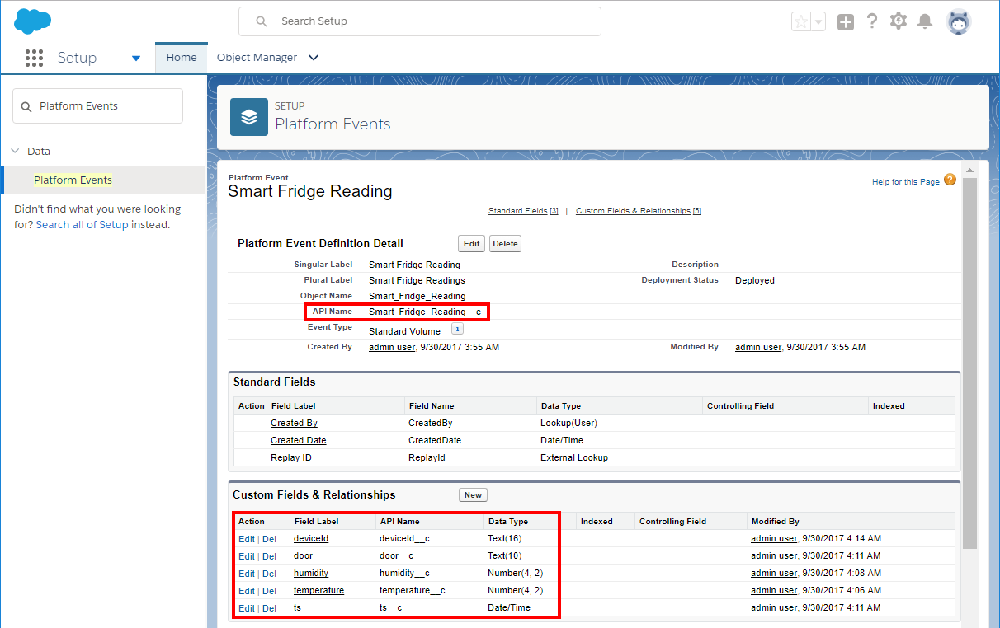
1. In the **Triggers** section, click **New**.

1. Enter the following code:
```
trigger SmartFridgeReadingReceived on Smart_Fridge_Reading__e (after insert) {
  List<SmartFridge__c> records = new List<SmartFridge__c>();
  for (Smart_Fridge_Reading__e event : Trigger.New) {
    SmartFridge__c record = new SmartFridge__c();
    record.deviceId__c = event.deviceId__c;
    record.temperature__c = event.temperature__c;
    record.humidity__c = event.humidity__c;
    record.door__c = event.door__c;
    record.ts__c = event.ts__c;
    records.add(record);
  }
  insert records;
}
```
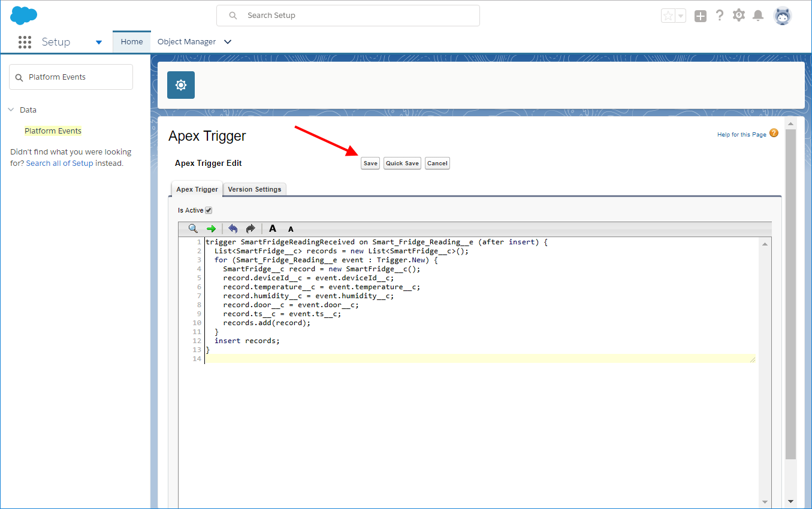
1. Click **Save**.

**Note** Typically, you would use an Orchestration to update the SmartFridge records, but since we are not implementing any logic or decision-making for this step, we use the Apex Trigger as an alternative to Orchestration. This approach may help you with any troubleshooting.

### Adding Salesforce ID Data to Your Agent Code

1. Return to impCentral.
1. Find the *SALESFORCE CONSTANTS* section at the **end** of the agent code and make sure your **READING_EVENT_NAME** constant value is **Smart_Fridge_Reading__e** (ie. the same as **Smart Fridge Reading API Name** value of the Platform Event you just created).

1. Again, do not close impCentral.

## Step 7: Create a Context in Salesforce

This is needed to help set up the IoT Explorer Orchestration.

1. On the Salesforce page, click the **Setup** icon in the top-right navigation menu and select **Setup**.

1. Enter **Contexts** into the **Quick Find** box and then select **Contexts**.
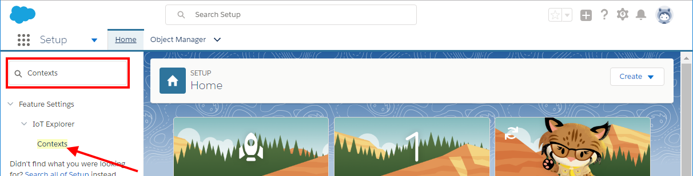
1. Click **New Context**.
1. In the **New Context** form, fill in:
    1. Context Name: **Smart Fridge Context**
    1. Key Type: **String**
    1. Click **Save**.
1. You will be redirected to the **Smart Fridge Context** page. In the **Platform Events** section, click **Add**.

1. In the **Add Platform Event** form, fill in:
    1. Context: **Smart Fridge Context**
    1. Platform Event: choose the **Smart Fridge Reading** Platform Event you created earlier.
    1. Key: choose **deviceId**
    1. Click **Save**.

## Step 8: Create a Custom Case Field in Salesforce

This example uses customized Cases which are standard Case objects with an additional field for device ID.

1. On the Salesforce page, click **Setup** icon in the top-right navigation menu and select **Setup**.

1. Click the **Object Manager** tab next to **Home**.

1. Click **Case**.
1. Select the **Fields & Relationships** section and click **New**.
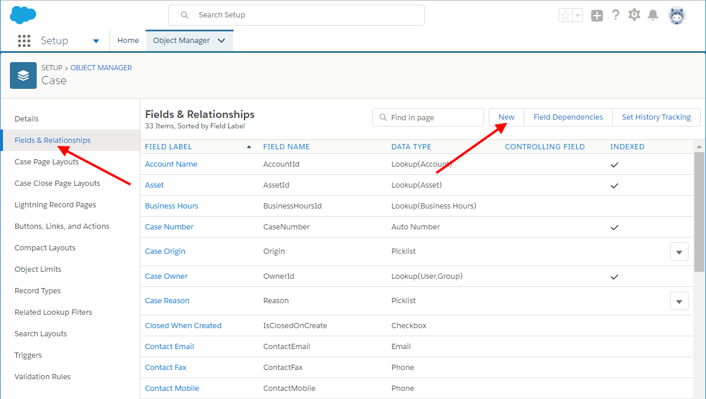
1. In the **New Custom Field** form:
    1. In the **Step 1. Choose the field type** section:
        1. Data Type: **Text**
        1. Click **Next**.
    1. In the **Step 2. Enter the details** section:
        1. Field Label: **deviceId**
        1. Length: **16**
        1. Field Name: **deviceId**
        1. Check **Set this field as the unique record identifier from an external system**.
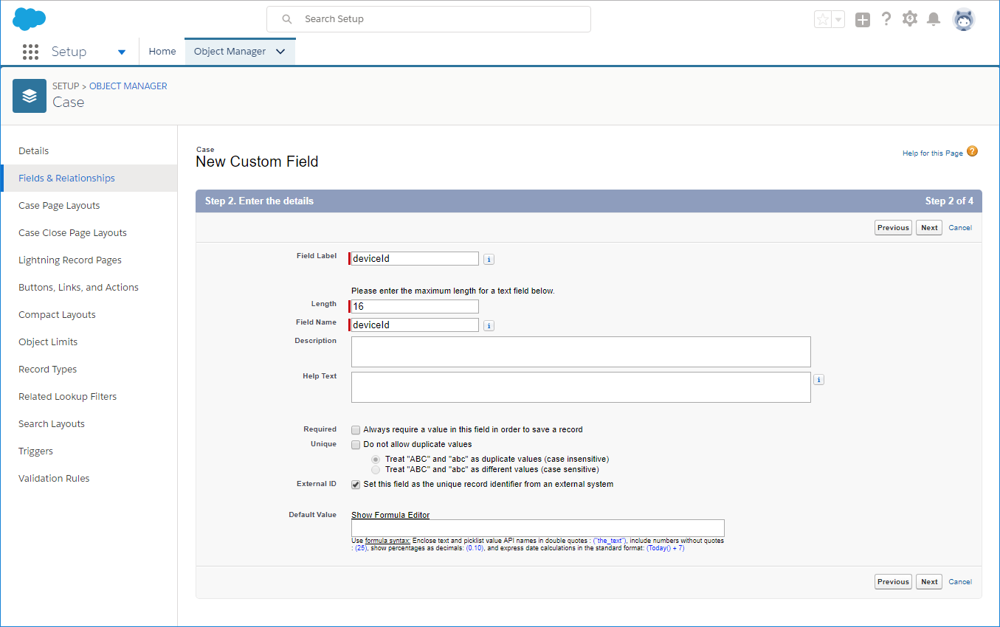
    1. Click **Next**, **Next** and then **Save**.
1. Select the **Fields & Relationships** section and find your newly created **deviceId** custom field.
1. Make sure the **Field Name** is set to **deviceId__c**.


## Step 9: Create an Orchestration in Salesforce

This example demonstrates how to create an Orchestration. A Salesforce Orchestration defines a fridge state machine. You can see in the following diagram how a fridge is normally in the 'Default' state but will move to one of the other states as it reacts to Platform Events. In this example, as the device moves into these other states, the Orchestration will open Cases based the following specific rules, which are set up as part of the Orchestration:

1. The refrigerator door is opened during three consecutive data readings (the exact threshold is between 30 and 45 seconds).
2. The temperature rises above 11&deg;C.
3. The relative humidity rises above 70%.


If you are wondering why there are no transitions between Open, Temperature Over Threshold and Humidity Over Threshold, it is because such transitions would result in multiple cases being opened simultaneously. This should be avoided, so the state machine is set up to ensure that further cases won’t be created until a given issue is resolved and the impExplorer returned to the Default state.

### Create the Orchestration

1. On the Salesforce page, click the **Setup** icon in the top-right navigation menu and select **Setup**.

1. Enter **Orchestrations** into the **Quick Find** box and select **Orchestrations**.

1. Click **New Orchestration**.
1. In the **New Orchestration** popup, fill in:
    1. Name: **Smart Fridge Orchestration**
    1. Context: choose the Smart Fridge Context you created earlier.

    1. Click **Create**.
    1. You will be redirected to the **Smart Fridge Orchestration** page.

### Set Up Orchestration Variables

1. Click the **VARIABLES** tab. Now you can to set up temperature and humidity thresholds, and a door opening counter and limit
1. Click **Add Variable**.
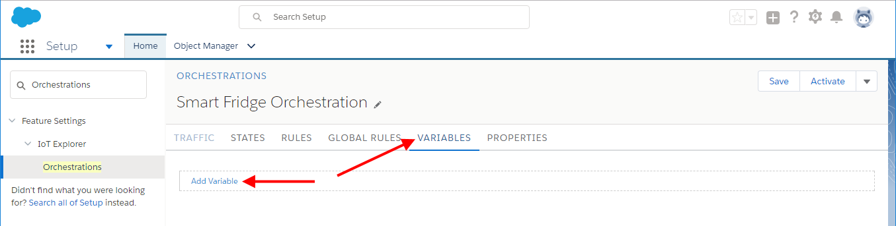
1. Create a variable for the temperature threshold.
    1. Name: **TEMPERATURE_THRESHOLD**
    1. Data Type: **Number**
    1. Initial Value: **11** (for 11&deg;C).
    1. Click **Add Variable**.
1. Create a variable for the humidity threshold.
    1. Name: **HUMIDITY_THRESHOLD**
    1. Data Type: **Number**
    1. Initial Value: **70** (for 70%).
    1. Click **Add Variable**.
1. Create a variable for the door opening counter limit.
    1. Name: **DOOR_OPEN_LIMIT**
    1. Data Type: **Number**
    1. Initial Value: **3** (for three consecutive data readings with door status).
    1. Click **Add Variable**.
1. Create a variable for the door open counter.
    1. Name: **door_open_counter**
    1. Data Type: **Number**
    1. Event Type: **Smart_Fridge_Reading__e** (the Platform Event you created earlier).
    1. IF: **Smart_Fridge_Reading__e.door__c = "open"**
    1. Value: **Count 40 sec** (for three consecutive data readings fit in 40 seconds).
    1. Initial Value: **0**
1. Make sure your Orchestration variables look like this:


### Establish Orchestration Global Rules

1. Click the **GLOBAL RULES** tab.
1. In the **When** column, choose **Smart_Fridge_Reading__e**.
1. In the **IF** column, add: **Smart_Fridge_Reading__e.door__c = "closed"**.
1. In the **Action** column, choose **Reset Variable** and then choose **door_open_counter**.
1. Make sure your **GLOBAL RULES** page looks like this:
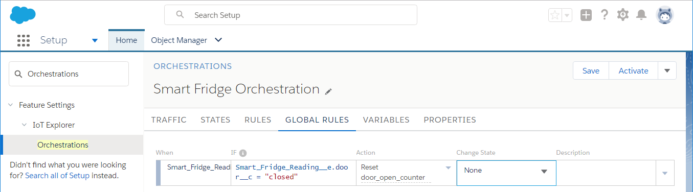

### Create Orchestration Rules

1. Click the **Rules** tab.

#### 1. Door Open Rule

1. Click **Add State**.

1. Enter **Door Open** as the new state name.
1. In the **When** column of the **Door Open** state, click **Select when to evaluate rule** and choose **Smart_Fridge_Reading__e**.
1. In the **Condition** column, enter: **Smart_Fridge_Reading__e.door__c = "closed"**
1. In the **Transition** column, choose **Default**.

1. In the **When** column of the **Default state**, click **Select when to evaluate rule** and choose **Smart_Fridge_Reading__e**
1. In the **Condition** column, enter: **door_open_counter >= DOOR_OPEN_LIMIT**
1. In the **Actions** column, click **Add an action** and choose **OUTPUT ACTIONS > Salesforce Record**
1. In the **New Salesforce Output Action** popup, choose:
    1. Object: **Case**
    1. Action Type: **Create**

1. Click **Next**.
1. In the **Assign values to record fields** table:
    1. Click **Add Field**.
    1. Choose **deviceId__c** in **Select field**.
    1. Enter value: **Smart_Fridge_Reading__e.deviceId__c**
    1. Click **Add Field**.
    1. Choose **Subject** in **Select field**.
    1. Enter **Subject** value: **"Refrigerator Door Open"**
    1. Click **Add Field**.
    1. Choose **Description** in **Select field**.
    1. Enter **Description** value: **"door has been opened for too long"**
1. In the **Action Name** field, enter: **Create Door Open Case**
1. Make sure that the **Assign values to record fields** table looks like this:

1. Click **Finish**.
1. In the **Transition** column, choose **Door Open**.


#### 2. Temperature Threshold Rule

1. Click **Add State**.
1. Enter **Temperature Over Threshold** as the new state name.
1. In the **When** column of the **Temperature Over Threshold** state, click **Select when to evaluate rule** and choose **Smart_Fridge_Reading__e**.
1. In the **Condition** column, enter: **Smart_Fridge_Reading__e.temperature__c < TEMPERATURE_THRESHOLD**
1. In the **Transition** column, choose **Default**.

1. Click **Add rule** in the **Default state** menu.
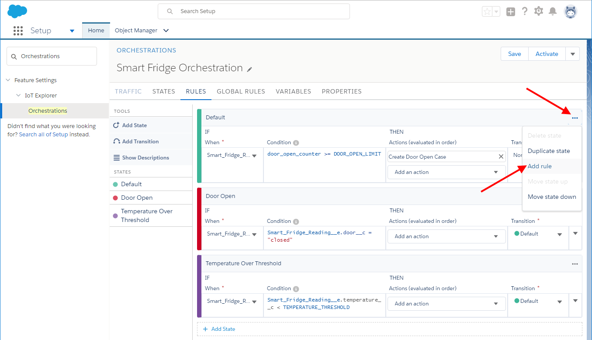
1. In the **When** column, click **Select when to evaluate rule** and choose **Smart_Fridge_Reading__e**.
1. In the **Condition** column, enter: **Smart_Fridge_Reading__e.temperature__c >= TEMPERATURE_THRESHOLD**
1. In the **Actions** column, click **Add an action** and then choose **OUTPUT ACTIONS > Salesforce Record**.
1. In the **New Salesforce Output Action** popup choose:
    1. Object: **Case**
    1. Action Type: **Create**
    1. Click **Next**.
1. In the **Assign values to record fields** table:
    1. Click **Add Field**.
    1. Choose **deviceId__c** in **Select field**.
    1. Enter value: **Smart_Fridge_Reading__e.deviceId__c**
    1. Choose **Subject** in **Select field**.
    1. Enter **Subject** value: **"Temperature Over Threshold"**
    1. Click **Add Field**.
    1. Choose **Description** in **Select field**.
    1. Enter **Description** value: **"current temperature " + TEXT(Smart_Fridge_Reading__e.temperature__c) + " is over threshold"**
1. In the **Action Name** field, enter: **Create Temperature Case**
1. Make sure that the **Assign values to record fields** table looks like this:
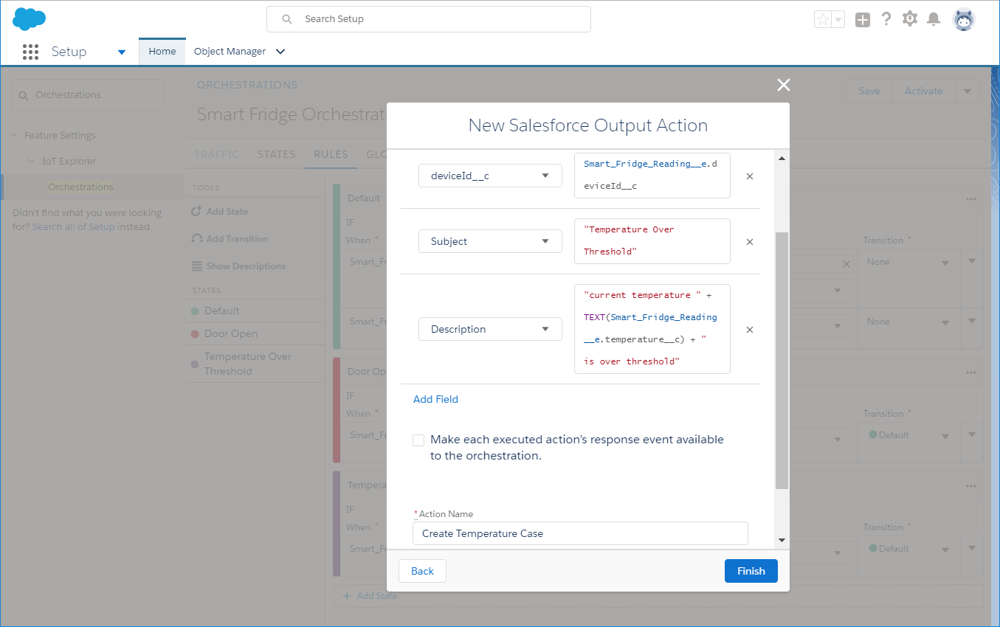
1. Click **Finish**.
1. In the **Transition** column, choose **Temperature Over Threshold**.


#### 3. Humidity Threshold Rule

1. Click **Add State**.
1. Enter **Humidity Over Threshold** as the new state name.
1. In the **When** column of the **Humidity Over Threshold** state, click **Select when to evaluate rule** and choose **Smart_Fridge_Reading__e**.
1. In the **Condition** column, enter: **Smart_Fridge_Reading__e.humidity__c < HUMIDITY_THRESHOLD**
1. In the **Transition** column, choose **Default**.

1. Click **Add rule** in the **Default state** menu.
1. In the **When** column, the new rule click **Select when to evaluate rule** and then choose **Smart_Fridge_Reading__e**.
1. In the **Condition** column, enter: **Smart_Fridge_Reading__e.humidity__c >= HUMIDITY_THRESHOLD**
1. In the **Actions** column, click **Add an action** and choose **OUTPUT ACTIONS > Salesforce Record**.
1. In the **New Salesforce Output Action** popup choose:
    1. Object: **Case**
    1. Action Type: **Create**
    1. Click **Next**.
1. In the **Assign values to record fields** table:
    1. Click **Add Field**.
    1. Choose **deviceId__c** in **Select field**.
    1. Enter value: **Smart_Fridge_Reading__e.deviceId__c**
    1. Choose **Subject** in **Select field**.
    1. Enter **Subject** value: **"Humidity Over Threshold"**
    1. Click **Add Field**.
    1. Choose **Description** in **Select field**.
    1. Enter **Description** value: **"current humidity " + TEXT(Smart_Fridge_Reading__e.humidity__c) + " is over threshold"**
1. In the **Action Name** field enter: **Create Humidity Case**.
1. Make sure that the **Assign values to record fields** table looks like this:

1. Click **Finish**.
1. In the **Transition** column, choose **Humidity Over Threshold**.


### Orchestration Activation

1. Click the **STATES** tab. Make sure that your states diagram looks like this:
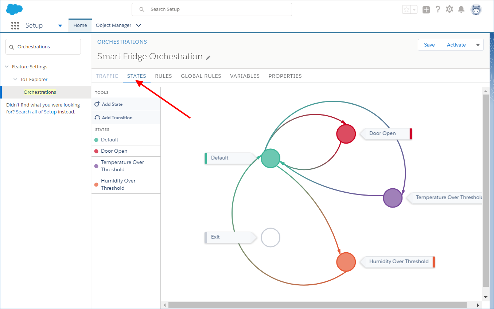
1. Click **Activate**.
1. In the **Activating Orchestration** popup, click **Activate**.
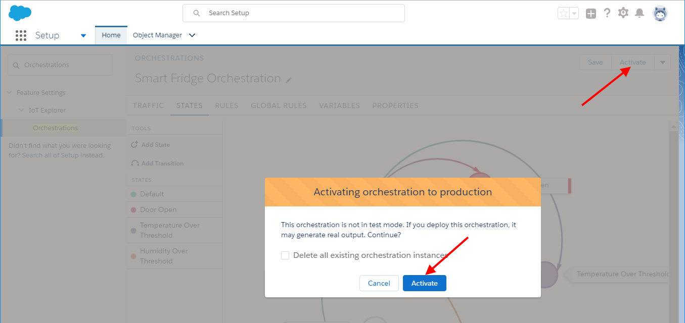
1. Do not close the Salesforce page.

## Step 10: Build and Run the Electric Imp Application

1. Return to impCentral.
1. Make sure your device is powered on and connected to Wi-Fi; impCentral should show the device is online.
1. Click **Build & Run All** to syntax-check, compile and deploy the code.
1. Look at the log pane to see messages from your running application. If you see **[Agent] ERROR: Not logged into Salesforce**, it means your application is not authorized to connect to Salesforce. This example uses OAuth 2.0 for authentication, and the agent has been set up as a web server to handle the authentication procedure.
    1. Click the agent URL in impCentral.
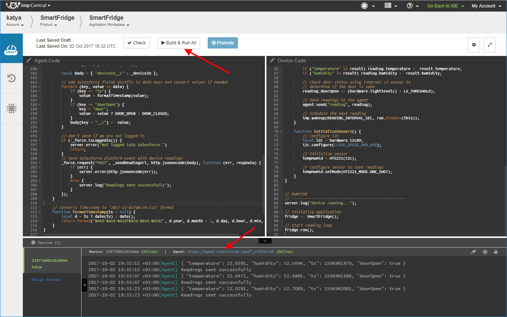
    1. You will be redirected to the login page.
    1. Log into Salesforce *on that page*.
    1. If login is successful, the page should display **"Authentication complete - you may now close this window"**.
    1. Close that page and return to impCentral.
1. Make sure there are no further errors in the logs.
1. Make sure there are periodic logs like this: **[Agent] Readings sent successfully**.
1. Your application is now up and running.

## Step 11: Place Your impExplorer Kit in a Refrigerator

Open your refrigerator and place the impExplorer Kit on a shelf in your refrigerator door.

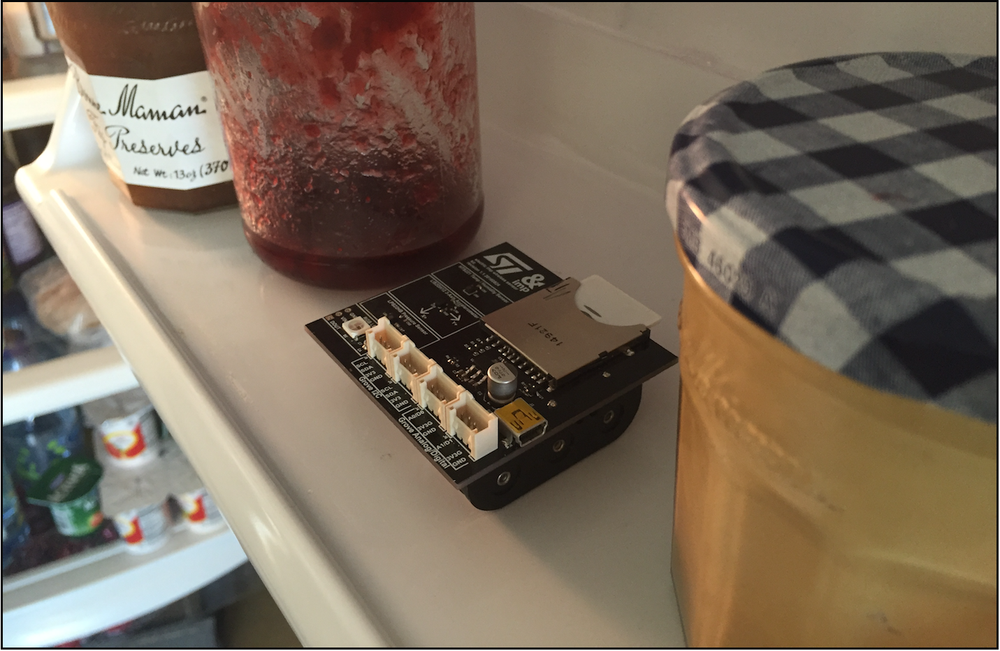

If you don’t have a fridge handy for this scenario, you can test the example by emulating different conditions. For example, you can emulate a fridge door being open or closed by placing the impExplorer under a light or into a really dark place. Emulate the high temperature case by moving the device from a cold place to a much warmer one.

## Step 12: Monitor the Transmitted Data

You can use the Salesforce1 mobile app to see the data that your device sends. To do this, you need to perform the following tasks.

### 1. Create a Custom Object Tab

This is needed to make the Custom Object with the stored data from the device accessible by Salesforce1.

1. Return to Salesforce.
1. Click the **Setup** icon in the top -right navigation menu and select **Setup**.

1. Enter **Tabs** into the **Quick Find** box and select **Tabs**.
1. Under **Custom Object Tabs**, click **New**.
1. Choose **SmartFridge** from the **Object** dropdown.
1. Choose **Thermometer** as the Tab Style.<br>

1. Click **Next**, **Next**, and then **Save**.

### 2. Check Salesforce1 is Enabled

1. Click the **Setup** icon in the top-right navigation menu and select **Setup**.

1. Enter **Salesforce1** into the **Quick Find** box and select **Salesforce1 Settings**.
1. Make sure the **Enable the Salesforce1 mobile browser app** is checked.<br>
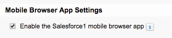
1. Enter **Users** in the **Quick Find** box and select **Users**
1. Click **Edit** next to your username.
1. Make sure that **Salesforce1 User** is checked. If not, check it and click **Save**.<br>


### 3. Run Salesforce1

You can access and run Salesforce1 in three ways.

- As a mobile app that you download from the Apple iTunes Store or Google Play, and install and run on your phone. This is the recommended approach.
- By opening the **login.salesforce.com** page in a browser on your phone.
- By using the Chrome Developer Tools (described below).

#### Open Salesforce1 in Chrome Browser

Use this approach if you want or need to run Salesforce1 on your PC, not on a mobile phone. It is possible to emulate Salesforce1 in the Chrome web browser.

1. On the Salesforce page, click the **Setup** icon in the top-right navigation menu and select **Setup**.

1. Copy the current opened URL into clipboard.
1. Open a new tab in your Chrome browser.
1. Open the Chrome Developer Tools by clicking **View** > **Developer** > **Developer Tools**.
1. Click the **Toggle Device Mode** button to simulate your browser as a mobile device.

1. Paste the URL you copied before. **Do not press Enter**.
1. Remove the part of the URL immediately after **lightning.force.com**. For example:


1. Append **/one/one.app** to the end of the URL after force.com. For example:
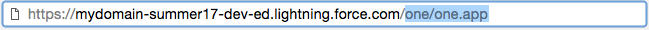
1. Press Enter. Salesforce1 emulation will start up in Chrome. If the display is too small, change the size to 100%:<br>

1. Click the hamburger menu in the upper left to open the navigation panel.
1. Under the **Recent** section, scroll down and click **More**.<br>
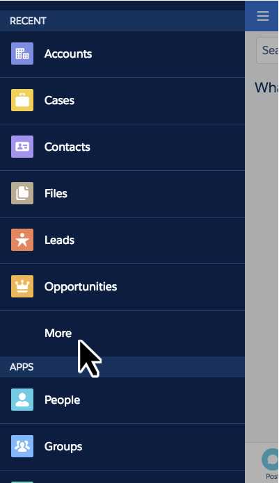
1. Find **SmartFridges** on the list and then click it.<br>
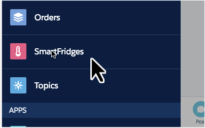
1. Select a record to view the details of the reading.<br>
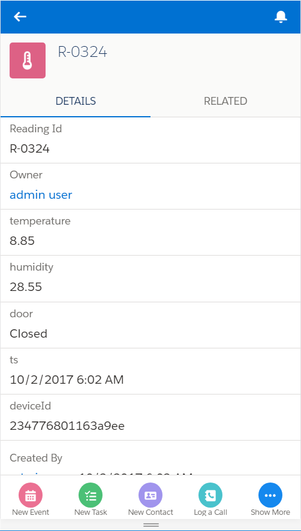

## Step 13: Monitor Orchestration State Transitions and Cases

You can now see transitions between the states that you defined in the IoT Explorer Orchestration section, as well as registered Cases.

1. On the Salesforce page, click the **Setup** icon in the top-right navigation menu and select **Setup**.

1. Enter **Orchestrations** into the **Quick Find** box and select **Orchestrations**.

1. Click **Smart Fridge Orchestration**.
1. Click the **TRAFFIC** tab.
1. If your impExplorer is inside a fridge, you should see that your device is in the **Default** normal state:

1. Keep the fridge door open for over 45 seconds (or just place the impExplorer in a brightly lit room). On the **TRAFFIC** tab, you should see that your device has now moved into the **Door Open** state:

1. Move the impExplorer to a warm dark place. On the **TRAFFIC** tab, you should see that your device has now moved into the **Temperature Over Threshold** state:

1. Run Salesforce1 as described in Step 12.
1. Click the hamburger menu in the upper left to open the navigation panel.
1. Under the **Recent** section, click **Cases**.<br>

1. You will see the registered Cases:<br>
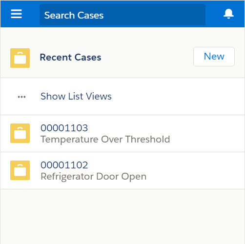

**Note** The Orchestration Traffic view is on a seven-second refresh but Platform Events are processed as they are received. This means you may see the Case created before the UI refreshes.
